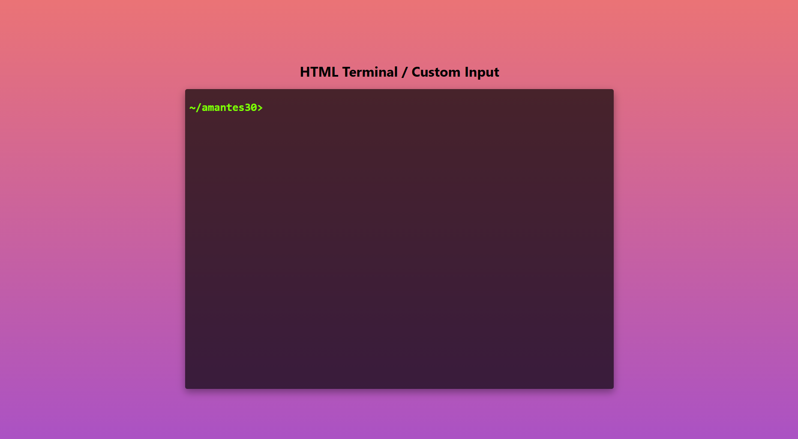

# HTML Terminal / Custom Input

An interactive **terminal-style input interface built entirely with HTML, CSS, and vanilla JavaScript**.

The project recreates the feel of a command-line terminal directly in the browser, including typed commands, a blinking cursor, command history, keyboard interaction, and basic command handling.

**Live Demo:**
https://amantes30.github.io/Custom-Input/

## Preview



## Features

* 🖥️ Terminal-style browser interface
* ⌨️ Real-time keyboard input
* ✨ Blinking terminal cursor
* ↩️ Enter key command execution
* ⌫ Backspace support
* 📜 Command history displayed inside the terminal
* 🧹 `cls` command for clearing the terminal
* ❓ `help` command for displaying available commands
* 📁 `projects` command
* ⚠️ Invalid command detection
* 🔍 Terminal focus/active-state handling
* 📱 Responsive viewport configuration
* 🎨 Customizable terminal styling

## Built With

* **HTML5**
* **CSS3**
* **JavaScript (Vanilla)**

No frameworks, libraries, package managers, or build tools are required.

## Project Structure

```text
Custom-Input/
├── index.html       # Main HTML page
├── style.css        # Terminal styling and animations
├── app.js           # Terminal input and command logic
├── screenshot.png   # Project preview
├── .gitignore
└── README.md
```

## How It Works

The application consists of three simple layers:

```text
HTML
 │
 ├── Terminal container
 ├── Command prompt
 └── Cursor
      │
      ▼
JavaScript
 │
 ├── Keyboard input
 ├── Command processing
 ├── Terminal history
 └── Error handling
      │
      ▼
CSS
 │
 ├── Terminal appearance
 ├── Cursor animation
 ├── Active/inactive states
 └── Responsive layout
```

## Terminal Interaction

The terminal is controlled using the keyboard.

### Typing

Click inside the terminal and start typing.

Characters are dynamically added to the active command line.

### Enter

Press `Enter` to execute the current command.

The entered command is added to the terminal history and a new command line is created.

### Backspace

Press `Backspace` to remove the last character from the current command.

## Available Commands

### `help`

Displays the available terminal commands.

```text
help
```

Output:

```text
Commands

cls  - Clears the terminal
help - List available commands
```

### `cls`

Clears the terminal output.

```text
cls
```

### `projects`

Displays the projects command output.

```text
projects
```

The current implementation contains a placeholder project link and can be customized to display an actual portfolio or project list.

### Invalid Commands

Commands that are not recognized are displayed as errors.

For example:

```text
hello
```

produces:

```text
Invalid command: "hello"
```

## Running Locally

Because this is a static website, there is no backend or build process required.

### Option 1 — Open Directly

Clone the repository:

```bash
git clone https://github.com/amantes30/Custom-Input.git
```

Enter the project directory:

```bash
cd Custom-Input
```

Then open:

```text
index.html
```

in your browser.

### Option 2 — Use a Local Development Server

If you use VS Code, you can run the project with an extension such as **Live Server**.

Alternatively, with Python installed:

```bash
python -m http.server 8000
```

Then open:

```text
http://localhost:8000
```

## Customization

The project is intentionally simple, so the terminal can be customized without introducing a framework.

### Change the Terminal Appearance

Most visual customization can be done in:

```text
style.css
```

For example:

```css
body {
    background: linear-gradient(
        180deg,
        #ec7474 0%,
        #a951c6 100%
    );

    color: chartreuse;
    font-family: monospace;
}
```

The terminal itself can also be customized through the `#terminal-form` styles.

### Add New Commands

Commands are handled in `app.js` inside the `handleSubmit()` function.

The current command handling follows a structure similar to:

```javascript
switch(input) {
    case 'cls':
        // Clear terminal
        break;

    case 'projects':
        // Show projects
        break;

    case 'help':
        // Show help
        break;

    default:
        // Invalid command
        break;
}
```

Additional commands can be added by creating new cases.

For example:

```javascript
case 'about':
    output.textContent = 'About me...';
    terminalFrom.appendChild(output);
    break;
```

## Adding Portfolio Commands

Because this project was originally designed around a terminal interface, it can easily be extended into an interactive portfolio.

Possible commands include:

```text
help
about
projects
skills
experience
contact
socials
clear
```

For example:

```text
~/amantes30> projects
```

could return:

```text
Projects

01  EMA Store
02  Custom Input
03  PDC Systems
04  AI Workflow Tools
```

The command system can therefore act as the navigation layer for an entire developer portfolio.

## Browser Compatibility

The project uses standard browser APIs and should work in modern browsers including:

* Google Chrome
* Microsoft Edge
* Mozilla Firefox
* Safari

## Deployment

The project is compatible with static hosting platforms such as:

* GitHub Pages
* Cloudflare Pages
* Netlify
* Vercel

The repository is currently deployed using **GitHub Pages**.

## Limitations

This project is intentionally lightweight and currently focuses on the terminal UI rather than implementing a complete shell environment.

Current limitations include:

* No command autocomplete
* No command history navigation with ↑ / ↓
* No command arguments or flags
* No persistent terminal history
* The `projects` command currently contains placeholder output
* No backend integration
* No framework or component system
* No automated tests

## Possible Improvements

Future improvements could include:

* [ ] Command autocomplete
* [ ] Arrow-key command history
* [ ] Command aliases
* [ ] Command arguments
* [ ] `about` command
* [ ] `skills` command
* [ ] `experience` command
* [ ] `contact` command
* [ ] Interactive project links
* [ ] GitHub repository integration
* [ ] Theme switching
* [ ] Mobile keyboard improvements
* [ ] Better accessibility support
* [ ] Persistent command history using `localStorage`

## License

No explicit open-source license is currently specified for this repository.

If you intend other people to freely use, modify, and redistribute the project, consider adding an appropriate license.

## Author

**amantes30**

GitHub:
https://github.com/amantes30

---

### Live Demo

Try the interactive terminal:

**https://amantes30.github.io/Custom-Input/**
